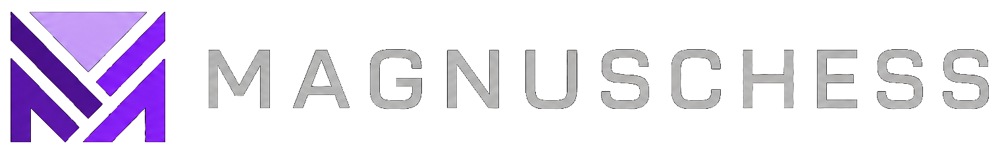

<div align="center">

  

  [![C++20][cpp-badge]][repo-link]
  [![UCI][uci-badge]][repo-link]
  [![Syzygy][syzygy-badge]][fathom-link]
  [![License][license-badge]][license-link]
  [![Commits][commits-badge]][commits-link]

</div>

MagnusChessX is a [C++20][cpp20-link] [UCI][uci-protocol-link] chess engine by Theodore Magnus &Oslash;en Nidhar, developed in its current form since 2026-03-24.

The official engine name is **MagXTK-14SM1**. It is the first official release in the MagXTK series, its software release version is **1.0.0**, and it is derived from the MagnusChess family.

MagXTK-14SM1 is a low-strength reference engine with rudimentary positional understanding and limited practical competitiveness. It communicates over the [Universal Chess Interface][uci-protocol-link], which means you can talk to it in the terminal,
or install it into a UCI-compatible graphical user interface, like [En Croissant](https://encroissant.org/download) or [Nibbler](https://github.com/rooklift/nibbler).

The default network line is P2 MNUE, maintained separately in [MagnusMNUE](https://github.com/TMagnusN/MagnusMNUE). P2 is the normal evaluation path used by ordinary search. MagnusChessX also contains an experimental X2-K16-pawn MNUE path, used to test a less conventional layout with separated piece, attack-edge, and pawn-pair feature families. X2 is included because its structure is interesting, not because it is advertised as the current strength target.

MagnusChessX does not support Chess960. It probes [Syzygy tablebases][syzygy-link] up to 7 pieces through the vendored [Fathom](https://github.com/jdart1/Fathom) backend.

PS: MagnusChessX's MNUE design learned a few architectural lessons from [Reckless](https://github.com/codedeliveryservice/Reckless).

## Building MagnusChessX

If you only want to build and run the engine, you need a [`g++`][gcc-link] compiler with basic [C++20][cpp20-link] support and [GNU Make][make-link].
For the trainer side of the project, make sure you have [Rust][rust-link] installed.
In my opinion, if you only need the engine, you do not need to install Rust.

0. Make sure your compiler toolchain is installed. On Windows this normally means a [MinGW-w64][mingw-w64-link] / [MSYS2][msys2-link]-style `g++` and `mingw32-make`; on Linux, a recent `g++` and `make`.
1. Clone this repository to your machine via `git clone git@github.com:TMagnusN/MagnusChessX.git`.
2. Enter the source directory via `cd MagnusChessX/Src`.
3. Make sure the embedded network is available. All neural networks for MagnusChessX can be found on the page of the [TMagnusN/MagnusMNUE](https://github.com/TMagnusN/MagnusMNUE) repository. Since the neural network files are large, they are stored separately from the main repository.

   Make sure your machine is connected to the network. The [Makefile](Src/Makefile) will automatically download the default embedded network when it is missing. You can also download the network manually and place it in the `build` directory.

4. Build MagnusChessX.

   **On Windows**, it is recommended to run
   ```text
   > mingw32-make auto PGO=1 -j
   ```

   **On Linux**, run the same build profile with
   ```text
   > make auto PGO=1 -j
   ```

The `auto` profile automatically detects the CPU flags supported by your machine and optimizes the engine for them. [`PGO=1`][pgo-link] builds an instrumented engine, runs the configured training workload, and then rebuilds the optimized binary.

## Evaluation Development History/Originality (HCE/MNUE)

- First evaluation was a hand-written evaluation function, used mainly to get the engine mechanics into shape: legal move generation, search stability, move ordering, time control behavior, and basic positional sanity.
- The first neural evaluation line replaced HCE with a 768-wide NNUE, moving MagnusChessX away from manually stacked evaluation terms and toward a learned evaluator that could be trained, exported, loaded, and checked as part of the normal engine loop.
- The current normal evaluation line is P2 MNUE. P2 is the default network family, the path expected by ordinary play, and the baseline against which later evaluation experiments have to justify themselves.
- Subsequent experimental work added the X2-K16-pawn MNUE path. X2 is not just a wider P2 network: it separates piece, attack-edge, and pawn-pair feature families, which makes it useful for testing whether a richer feature layout can represent tactical and structural information more directly.
- X2 is treated as experimental because an interesting architecture is not the same thing as proven strength. It exists in the engine so feature parity, loading, evaluation dispatch, and runtime behavior can be tested against the same search code as P2.
- Regular engine testing is kept on `UHO_4060_v4.epd` and a private [OpenBench][openbench-link] instance, so changes are compared against a fixed opening set instead of whatever positions happen to be convenient that day.

All neural-network architecture work currently used in MagnusChessX is designed for MagnusChessX and trained with [bullet](https://github.com/jw1912/bullet).
Current training data is generated with [Stockfish tooling](https://github.com/official-stockfish/Stockfish/tree/tools), so the project does not claim original self-play-only training data.
The current P2 trainer command and embedded-network sync workflow are documented in [Notes/MNUE_P2_TRAINER.md](Notes/MNUE_P2_TRAINER.md).

## Thanks and Acknowledgements

[Fathom](https://github.com/jdart1/Fathom), used for Syzygy tablebase probing. MagnusChessX relies on it for practical endgame tablebase support instead of carrying its own tablebase probe implementation.

[bullet](https://github.com/jw1912/bullet), used for neural-network training. It provides the training side that makes the MNUE experiments more than just file formats and engine loaders.

[Stockfish tooling](https://github.com/official-stockfish/Stockfish/tree/tools), used for training data generation.

[Reckless](https://github.com/codedeliveryservice/Reckless), whose public architecture helped inform parts of the MNUE design. MagnusChessX does not copy Reckless code; the useful lessons are re-derived inside its own network format, feature encoders, and validation workflow.

MagnusChessX is distributed under the MIT License. See [LICENSE][license-link].

[repo-link]: https://github.com/TMagnusN/MagnusChessX
[fathom-link]: https://github.com/jdart1/Fathom
[commits-link]: https://github.com/TMagnusN/MagnusChessX/commits/main
[license-link]: https://github.com/TMagnusN/MagnusChessX/blob/main/LICENSE
[cpp20-link]: https://en.cppreference.com/w/cpp/20
[uci-protocol-link]: https://www.shredderchess.com/chess-features/uci-universal-chess-interface.html
[gcc-link]: https://gcc.gnu.org/
[make-link]: https://www.gnu.org/software/make/
[msys2-link]: https://www.msys2.org/
[mingw-w64-link]: https://www.mingw-w64.org/
[rust-link]: https://www.rust-lang.org/tools/install
[syzygy-link]: https://syzygy-tables.info/
[pgo-link]: https://gcc.gnu.org/onlinedocs/gcc/Optimize-Options.html#index-fprofile-generate
[openbench-link]: https://github.com/AndyGrant/OpenBench

[cpp-badge]: https://img.shields.io/badge/C%2B%2B-20-blue?style=for-the-badge
[uci-badge]: https://img.shields.io/badge/Protocol-UCI-brightgreen?style=for-the-badge
[syzygy-badge]: https://img.shields.io/badge/Syzygy-7--piece-informational?style=for-the-badge
[license-badge]: https://img.shields.io/badge/License-MIT-success?style=for-the-badge
[commits-badge]: https://img.shields.io/github/last-commit/TMagnusN/MagnusChessX/main?style=for-the-badge&label=last%20commit
