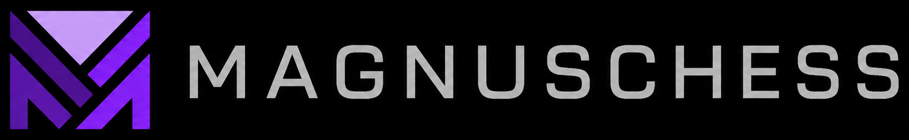

<p align="center">
  
</p>

<p align="center">
  
  
  
  
  
</p>

MagnusChessX Thinking is a C++20 UCI chess engine with a conventional
alpha-beta search core, MNUE evaluation support, optional Syzygy tablebase
probing, and command-line utilities for development checks.

## Engine Architecture

- Bitboard-based board representation.
- Incremental position state for hash keys, king squares, evaluation state,
  and repetition history.
- Core board implementation in `src/board/Attack.*`,
  `src/board/MoveGen.*`, and `src/board/Position.*`.
- Clustered transposition table with probe, save, prefetch, bound-aware
  storage, age tracking, and sampled `hashfull` reporting.
- UCI front end in `src/Uci.cpp`, with command parsing, option handling,
  asynchronous search management, and command-line utility dispatch.

## Search

- Iterative deepening with principal variation search.
- Quiescence search.
- Aspiration windows with widening fallback.
- Transposition table cutoffs.
- Internal iterative reductions.
- Razoring, reverse futility pruning, null-move pruning, futility pruning,
  late move pruning, history pruning, and late move reductions.
- Staged move ordering:
  `TT move -> good captures -> killer moves -> quiets -> bad captures`.
- Quiet move ordering uses quiet history, countermove history, and
  continuation history.
- Capture ordering uses capture history, static exchange evaluation, SEE
  bias, and MVV-LVA support.

## Evaluation And MNUE

- MNUE P2/P2Pro evaluation is the normal evaluation path.
- The standard build embeds a default MNUE P2 network.
- External P2/P2Pro-compatible network files can be selected through the
  `MNUEfile` UCI option.
- Headerless Bullet `quantised.bin` payloads are detected by exact raw size.
- Search expects an available MNUE evaluator for normal play.

The embedded network filename is configured in `src/Makefile`:

```text
MNUE_EMBEDDED_FILE := mm-8adbe41d1.MNUE
```

The build expects this file under `src/build/` so it can be included through
`src/mnue/MnueEmbedded.S`.

To convert a Bullet P2Pro `quantised.bin` checkpoint into a headered `.MNUE`
file:

```text
python tools/sync_p2pro_mnue.py path/to/checkpoint/quantised.bin
```

This writes `src/build/<checkpoint-directory>.MNUE`. Add `--set-embedded`
only when that P2Pro file should become the compile-time default.

Select an external MNUE file through UCI:

```text
setoption name MNUEfile value path/to/network.MNUE
```

Use the embedded network again with:

```text
setoption name MNUEfile value <embedded>
```

## Syzygy Tablebases

MagnusChessX Thinking probes local Syzygy `.rtbw` and `.rtbz` files through
the vendored MIT-licensed Fathom backend.

Supported behavior includes:

- Root DTZ ranking with WDL fallback.
- Internal WDL cutoffs with configurable piece and depth limits.
- 50-move-rule-aware root scores.
- UCI `tbhits` reporting.

UCI setup example:

```text
setoption name SyzygyPath value D:\tablebases
setoption name SyzygyProbeLimit value 7
setoption name SyzygyProbeDepth value 1
setoption name Syzygy50MoveRule value true
```

## Build

### Requirements

- 64-bit x86-64 compiler target.
- `g++` with C++20 support.
- `make` on Linux, WSL, or MSYS2.
- `mingw32-make` on Windows with MinGW.

The default `auto` profile maps to `native64` and uses `-march=native`. For a
portable x86-64 binary, build the `portable64` profile.

### Windows

```powershell
cd src
mingw32-make clean
mingw32-make auto -j
```

Repository-relative output:

```text
src/build/MagnusChessXThinking.exe
```

### Linux, WSL, Or MSYS2

```bash
cd src
make clean
make auto -j
```

Repository-relative output:

```text
src/build/MagnusChessXThinking
```

### Build Profiles

```bash
make auto -j
make portable64 -j
make native64 -j
make variants -j
make detect
```

### PGO Build

Set `PGO=1` to build an instrumented executable, run the configured training
workload, and rebuild with profile-guided optimization:

```bash
cd src
make auto PGO=1 -j
```

Windows uses the same variable:

```powershell
cd src
mingw32-make auto PGO=1 -j
```

PGO output is written as:

```text
src/build/MagnusChessXThinking-<profile>-pgo[.exe]
```

The default PGO training command is `bench`. Override it with
`PGO_BENCH_ARGS` if a different workload is required.

## Running

Start UCI mode with no arguments:

```bash
cd src
./build/MagnusChessXThinking
```

Or explicitly:

```bash
cd src
./build/MagnusChessXThinking uci
```

Windows:

```powershell
cd src
.\build\MagnusChessXThinking.exe uci
```

Command-line utilities:

```bash
./build/MagnusChessXThinking bench 12 64 1
./build/MagnusChessXThinking perft 5
```

## UCI Interface

Standard commands:

```text
uci
isready
ucinewgame
position
go
stop
ponderhit
quit
setoption
```

Supported `go` controls:

```text
depth
nodes
movetime
wtime
btime
winc
binc
movestogo
ponder
infinite
searchmoves
```

Primary UCI options:

| Option | Type | Default | Notes |
|---|---|---:|---|
| Hash | spin | 16 | Megabytes allocated to the transposition table. |
| Threads | spin | 1 | Search thread count, maximum 512. |
| MultiPV | spin | 1 | Multi-principal-variation output, maximum 256. |
| Contempt | spin | 0 | Evaluation offset, range -10000 to 10000. |
| Move Overhead | spin | 10 | Time-management overhead in milliseconds. |
| Ponder | check | false | Enables pondering support. |
| SyzygyPath | string | `<empty>` | Directory containing Syzygy files. |
| SyzygyProbeDepth | spin | 1 | Minimum depth for tablebase probes, range 1 to 100. |
| Syzygy50MoveRule | check | true | Applies 50-move-rule-aware tablebase scoring. |
| SyzygyProbeLimit | spin | 7 | Maximum tablebase piece count, range 0 to 7. |
| MNUEfile | string | `mm-8adbe41d1.MNUE` | External MNUE file path or `<embedded>`. |

Utility commands:

```text
d
eval
bench
perft <depth>
```

## Repository Layout

```text
src/                    Engine source
src/board/              Board representation, attacks, and move generation
src/mnue/               MNUE evaluator and embedded-network support
src/syzygy/             Syzygy integration
third_party/fathom/     Vendored Fathom tablebase probe
tools/                  Development and network-preparation utilities
docs/                   Development notes and reference documentation
```

## License And Credits

MagnusChessX Thinking is distributed under the MIT License. See `LICENSE` for
details.

Syzygy probing uses the vendored Fathom tablebase backend under its MIT
license. MNUE network preparation uses external Bullet-compatible training
tooling.
